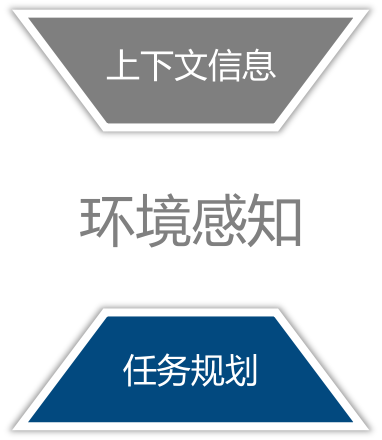

#### 行动决策与环境感知的任务协同分析-第一篇

​		前段时间都在谈论agent，可以说是引足了大家的眼球,今天我们也来深入的水一水

文章的开始我们先提几个问题？

> agent是替换监督学习和强化学习的方法？
>
> 在我们传统的nlp任务中，意图识别真的只能硬编码吗？
>
> agent 能不能用在生产

本篇我们先讨论agent是不是替换监督学习和强化学习的方法

内容主要来自《关于REACT中行动决策与环境感知的任务协同分析.pptx》其中参考文献，相关资料可从文章结尾参考文献获得

相信大部分水友，在头一次听到这个名词的时候，都是在langchain这个工具包中发现的，在其包中存在一个`ReAct`模块,关于这个模块的论文我们先水一期，附上链接`https://react-lm.github.io/`

听到`ReAct`这个词，可以说是包罗万象，大名鼎鼎的前端框架`React`一定是大家听的最多的。

左边是描述程序行为，帮助程序决策的思想。右边是前端发布构建工具，__实际这是两个东西__,

ReAct							React

 

__那有什么可以水的吗。。。__

让我们来讨论一下`React`是如何提出的吧。论文分别提供了以下三种形式的语言示例：

- (a) Standard

- (b) Chain-of-thought (CoT, Reason Only)

- (c) Act-only

- (d) ReAct (Reason+Act)

我们可以看到，论文使用了之前提出的三种理论来解决模型预测的问题，并且阐述了每种理论存在的弊端。

以“chain-of-thought”来作为标准来说，此推理和是一个静态的黑匣子，因为模型使用它自己的内部表征来产生思想，并且不以外部世界为基础，这限制了其适应推理或更新知识的能力。这可能会导致诸如事实之类的问题

__其余理论结果相同__

从`ReAct`举例的数据来看，我们观察到 `ReAct` 所展示的问题解决过程更具事实性和基础性，而 CoT 在构建推理结构方面更准确，但容易受到虚构事实或思维的影响。

因此，我们建议将ReAct和CoT-SC纳入考虑，并让模型基于以下启发式决定何时切换到其他方法：

A) ReAct → CoT-SC: 当 ReAct 在给定的步骤内未能返回答案时，切换到 CoT-SC。我们分别为 HotpotQA 和 FEVER 设置了7个步骤和5个步骤，因为我们发现增加步骤不会提高 ReAct 的性能。

B) CoT-SC → ReAct：当n个CoT-SC样本中的大多数答案发生不到n/2次（即内部知识可能不足以自信地支持任务）时，切换回 ReAct。

**得出结论：**那么在知识密集型推理任务中，多级问答和事实准确一定是需要考虑的，假设一个系统无法做到事实准确，无法以逻辑解释的系统，必然这个系统是无法使用的，大模型最近几年的论文中，每篇都切实的论述了这点，我们从`ReAct`中得出了一个这个结论，大型语言模型 (LLM) 可以通过特定的思维方式，使用逻辑结构解释语言和交互式决策制定，这对于我们是一个令人印象深刻的能力，*但它们的推理能力（例如思维链提示）和行动能力（例如行动计划生成）需要作为单独的主题进行研究*

不过，得到这个结论也是*非常的amazing*，我们从这个结论里可以做到哪些事情呢？

乍一看，这些专业术语似乎很复杂，有点让人望而生畏。不过，如果我们换个角度来思考，理解起来这些其实并不难。

我们来看下这个强化学习的示例，考虑有固定策略π，研究其相关的行为。机器理解逻辑控制单元，寻求最大化价值的策略，这一概念与最优路径的概念密切相关。

*我们观察到一系列最优策略相对应的值分布，策略分布图可以直观的展示*

而这个怎么就并不难了，强化学习固然是需要非常专业的领域的大佬才能设计，但是强化学习解决的问题其实是日常人的行为逻辑，知道了这个前提我们来解释下这个图再说什么

那么这个图来自《A Distributional Perspective on Reinforcement Learning》，作者提出了关于策略评估和控制的理论结果，用来实现风险感知行为，核心观点是强调了价值分布的基本重要性，它指的是强化学习代理接收的随机回报的分布。这与传统的强化学习方法不同，传统方法通常是建模对这个回报的期望值或价值。

说了这么半天，什么是风险感知行为，实际吧，这就是再讨论危险怎么认定的问题，从我们人类的角度，认定风险是一个学习过程，例如看见黄色标牌、红色路标、听到高频的声波，我们会本能的认为会发生危险

下面我们大概的总结下这里的内容

论文指出，相比于使用提示方法，使用ReAct微调方法可以获得更好的性能。此外，即使是在模型大小相同的情况下，使用ReAct微调较小的模型也可以获得比提示较大模型更好的性能。这表明ReAct微调方法可以帮助提高模型性能，并且在资源受限的情况下也可以实现更好的性能

虽然大型语言模型 (LLM) 在语言理解和交互式决策制定等任务中展示了令人印象深刻的能力，但它们的推理能力（例如思维链提示）和行动能力（例如行动计划生成）需要作为单独的主题进行研究

*讨论学术不是在讨论权威，本文的所有内容作者没有全部复现，祝您心明眼亮，图一乐儿*

参考文献：

1. https://arxiv.org/pdf/2210.03629.pdf

2. https://arxiv.org/abs/1707.06887

3. https://arxiv.org/abs/2201.11903

4. https://blog.csdn.net/qq_38293297/article/details/108711288

5. 《关于REACT中行动决策与环境感知的任务协同分析.pptx》在[chatchat-space/chatchat-knowledgebase](https://github.com/chatchat-space/chatchat-knowledgebase.git)

   

