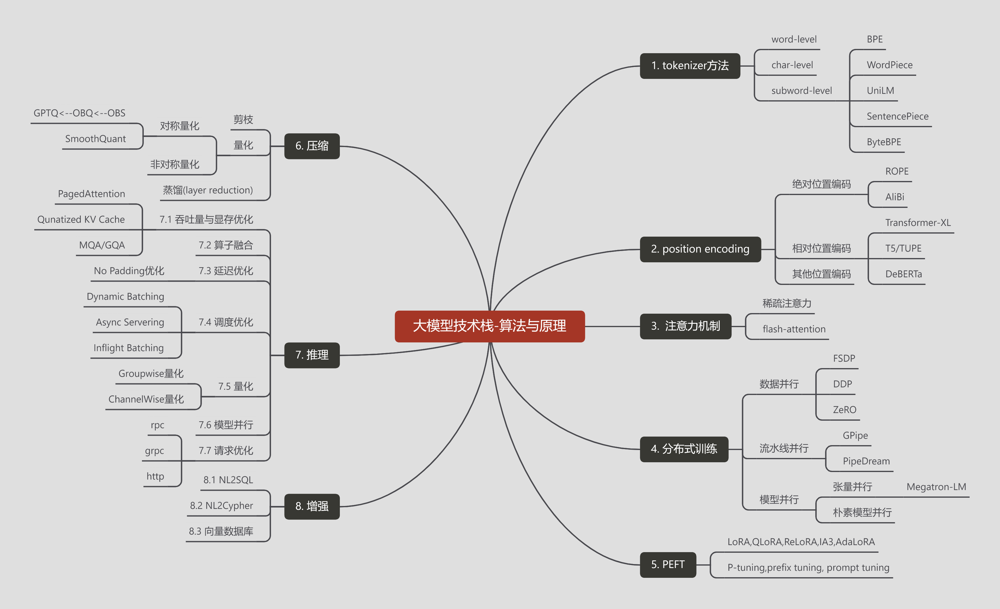
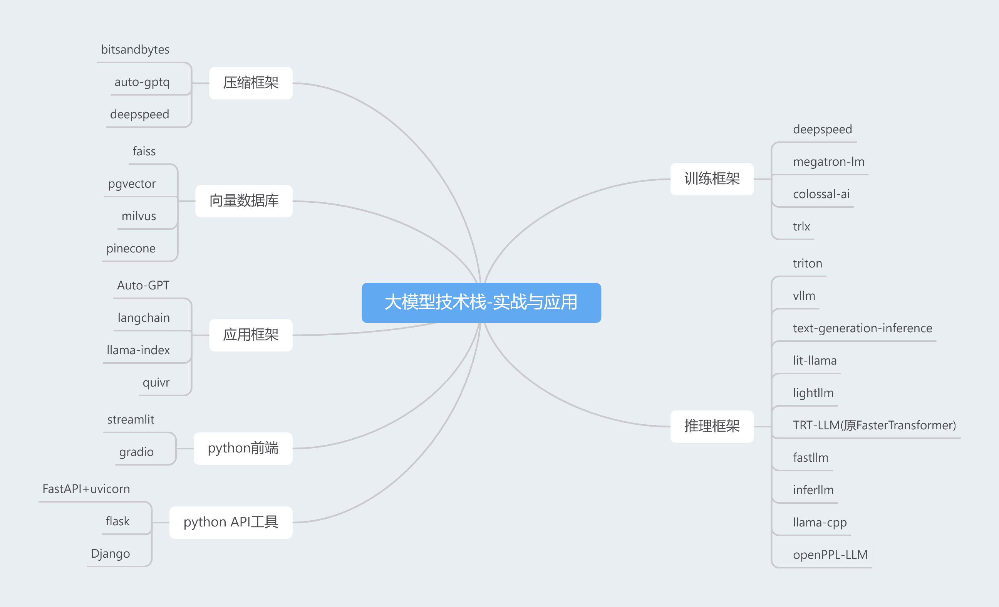

# 公众号简介

**Hello there!**

Everybody, put your hands up! 无人期待的langchain-chatchat官方订阅号终于上线了！！！

本公众号计划分三个栏目：

* langchain-chatchat官方事件发布
* 大模型技术栈-算法与原理
* 大模型技术栈-实战与应用

## 1. langchain-chatchat官方事件发布

**图1 langchain-chatchat框架总览**

本栏目主要发布项目相关信息，计划发布包括但不限于如下内容：

* 版本更新简报
* 紧急补丁公告
* 常见错误问题定位与解决方案
* 重要依赖包更新简况
* 为开发组提供各种白嫖资源的金主爸爸的各种硬广与软广
* 还没想好的其他内容

## 2. 大模型技术栈-算法与原理

**图2 大模型技术栈-算法与原理**

本栏目主要关注大模型全流程的算法与原理解读，计划发布包括但不限于如下内容：

* tokenzier技术
* position encoding技术与上下文外推技术
* 大模型技术常用的高效注意力机制
* 大模型分布式训练技术
* 各种PEFT技术
* 以量化为主的模型压缩技术
* 推理加速与显存优化技术
* 大模型推理增强方案
* 限于作者能力而导致内容解读错误的道歉信

## 3. 大模型技术栈-实战与应用

**图3 大模型技术栈-实战与应用**

本栏目主要关注大模型落地相关的开源框架解析，计划发布包括但不限于如下内容：

* 大模型训练框架
* 大模型推理框架
* 大模型压缩框架
* 向量数据库
* 大模型落地应用框架
* 主流python前端框架
* 主流python API工具
* 与大模型落地相关的其他技术方案与框架
* 与大模型落地无关但作者觉得不吐不快的一些问题

## 4. 几点重要说明

1. **限于几位作者都是正经打工人，更新频率可能无法保证；**
2. **限于几位作者的能力可能会出现解读错误的问题，在此希望广大开发者能不吝批评指正；**
3. **栏目二和栏目三属于常规的画饼环节，别太当真；**
4. **广告位长期招租；**

## 5. 总结

总而言之，言而总之，事情就是这么个事情，情况就是这么个情况，langchain-chatchat开发组开通了订阅号~~求赞助~~分享技术，希望大家多多支持。
